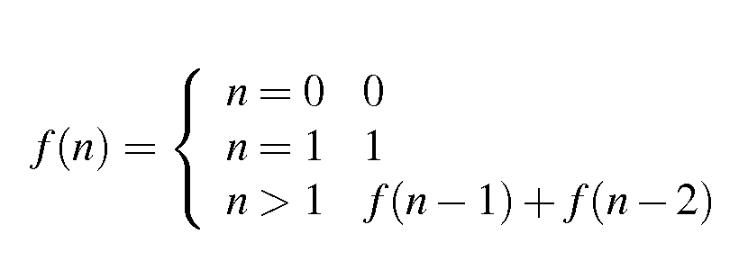

# Python Introduction

## Conditional statements
In this exercise, we will once more focus on the usage of the conditional statements, including:  
 - if-else statements,
 - input from the user,
 - for and while loops, 
 - comparison operators,
 - assignment operators,
 - logical operators.
 
## 

## Tasks

### 

### :heavy_plus_sign: Task 1 - calculate sum

Your task is to write a Python program to calculate the sum of three integers given (prompted) by user.  
If the values are equal then calculate triple value of their sum.  
Print out an appropriate message to the user.

- Some of your results could look like this:


```bash
First number: 3
Second number: 4
Third number: 5
The sum is:  12

First number: 5
Second number: 5
Third number: 5
The triple sum is:  45
 ``` 

### :heavy_plus_sign: Task 2 - get the difference

Your task is to write a Python program to get the difference between a two given numbers (prompted by user).  
If the first number is greater than second then calculate double difference between numbers.  
Otherwise calculate the **absolute** difference between numbers.  
Print out an appropriate message to the user.

- Some of your results could look like this:


```bash
First number: -2
Second number: -3
The result of calculation is  2

First number: 6
Second number: 6
The result of calculation is  0

First number: 4
Second number: 7
The result of calculation is  3
``` 

### :heavy_plus_sign: Task 3 - odd or even number

Your task is to write a Python program to find whether a given number (prompted from the user) is even or odd.  Print out an appropriate message to the user.

- Some of your results could look like this:


```bash
Number to check: 43
43 is an odd number!

Number to check: 32
32 is an even number!
``` 

### :heavy_plus_sign: Task 4 - circle area

Your task is to write a Python program which accepts (prompts) the **float** radius of a circle from the user and compute its [area](https://www.mathsisfun.com/geometry/circle-area.html).  
Round the result to two decimals!  
Print out an appropriate message to the user.

>Hint: You can import `pi` number from `math` module for convenience!


- Some of your results could look like this:


```bash
Input the radius of the circle : 3.45
The area of the circle with radius  3.45  is:  37.39
``` 

### :heavy_plus_sign: Task 5 - guess a number

Your task is to write a Python program to guess a number between 1 to 9.

>Note : User is prompted to enter a guess. If the user guesses wrong then the prompt appears again until the guess is correct, on successful guess, user will get a "Well guessed!" message, and the program will exit.

>Hint: you don't know the `random` module yet, so set your number to guess hard-coded in your program. 

- Some of your results could look like this:

```bash
Guess a number between 1 and 10 until you get it right : 9
Guess a number between 1 and 10 until you get it right : 3
Guess a number between 1 and 10 until you get it right : 4
Guess a number between 1 and 10 until you get it right : 5
Guess a number between 1 and 10 until you get it right : 6
Guess a number between 1 and 10 until you get it right : 7
Well guessed!
```

### :heavy_plus_sign: Task 6 - Celsius to Fahrenheit conversion

Your task is to write a Python program to convert temperatures to and from Celsius, Cahrenheit.

In the centigrade scale, which is also called the Celsius scale, water freezes at 0 degrees and boils at 100 degrees.  
In the Fahrenheit scale, water freezes at 32 degrees and boils at 212 degrees. 

Note : User should be prompted twice:  
 - to enter a temperature,  
 - to enter a shortcut for given scale (C for Celsius, F for Fahrenheit).

> Formula : C/5 = F-32/9, where C = temperature in Celsius and F = temperature in Fahrenheit. 

- Some of your results could look like this:

```bash
Input the scale shortcut you'd like to convert (F - Fahrenheit, C - Celsius: C
Input the value of temperature you'd like to convert  : 60
The temperature in Fahrenheit is 140 degrees.
```

### :heavy_plus_sign: Task 7 - pattern

Your task is to write a Python program to construct the following pattern. Upper part should be done **in one line** of code without using a loop.  
Lower part can be done with any kind of loop **or** also with one line of code and without loops.

```bash
* 
* * 
* * * 
* * * * 
* * * * * 
* * * * 
* * * 
* * 
*
```

>Hint: to print the same string few times you can use simple multiplication:
```python
print(3 * '+ ')
```
And it gives three `+` signs:
```bash
+ + +
```

- Some of your results could look like this:

```bash
* 
* * 
* * * 
* * * * 
* * * * * 
* * * * 
* * * 
* * 
*
```

### :heavy_plus_sign: Task 8 - Fibonacci series

Your task is to write a Python program to get the Fibonacci series between 0 to 50.  
>Note: The Fibonacci Sequence is the series of numbers :
0, 1, 1, 2, 3, 5, 8, 13, 21, ....  
Every next number is found by adding up the two numbers before it.  



>Hint: There are few ways to do this task. You can use for example while loop and variable swapping.

- Some of your results could look like this:

```bash
1
1
2
3
5
8
13
21
34
```